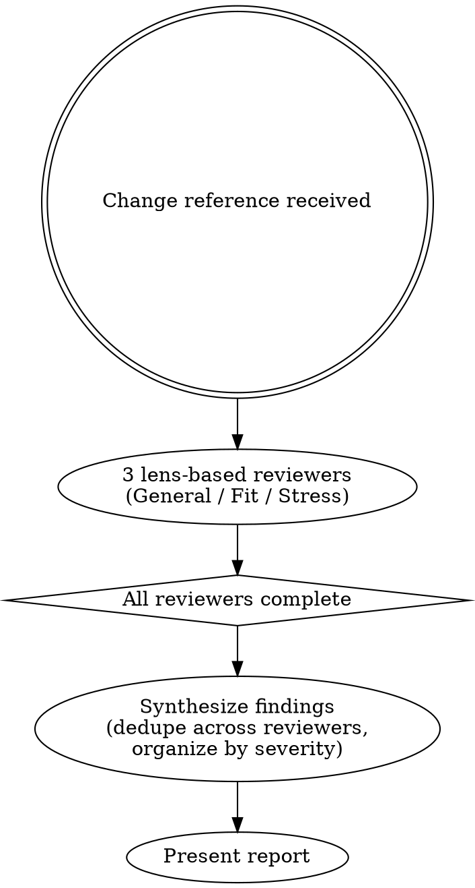

# Panel

## Overview

Review code changes by launching a panel of 3 lens-based reviewer subagents in parallel, then synthesizing their findings into a single report. Reviewers are the authorities on what they find — each one grounds its findings in code it actually read. The main session's role is orchestration: dedupe across reviewers, organize by severity, present.

## Input

A reference to the changes to review:

- **PR/MR reference** — URL, number, or `owner/repo#123`. The skill detects the platform from the remote URL or context (GitHub → `gh`, GitLab → `glab`, etc.)
- **Branch name** — review the diff of a local branch against the base branch (e.g., `main`)
- **Diff range** — any git diff range (e.g., `main...feature-branch`)

If no explicit reference is given, default to reviewing the current branch's changes against the main branch.

## Process



### Phase 1: Launch all reviewers (in parallel)

3 reviewers per pass, **one per lens**, launched in parallel as fresh subagents. The main session does not review or gather context during this phase — proceed to Phase 2 once reviewers return.

Three pre-defined multi-purpose lenses — General is itself a lens, so every pass runs a holistic reviewer alongside the focused ones:

| Lens | What it hunts |
|---|---|
| **General** | No narrow focus — reviews the change holistically. Catches cross-cutting issues, anomalies, and anything the focused lenses might miss as "not their lane" |
| **Fit** | Reuse and convention — existing helpers, patterns, or modules the change should use instead of inventing; new code conflicting with conventions visible in adjacent files |
| **Stress** | What breaks the change: edge cases (nil/empty/error paths, off-by-ones, happy-path skips), adversarial framing (shadow paths, ordering hazards), and scale / data-access (N+1 reads/writes, loops over DB or network calls, missing bulk/batch ops — mentally run at 10× and 1000× input) |

Use different models across the 3 slots when practical (e.g. haiku + sonnet + opus) for cross-model bias variation on top of lens diversity. Drop a focused lens if clearly not applicable and use that slot for a second General reviewer.

Each reviewer should start in a fresh session with no inherited chat context from the main session.

Give each reviewer:

- The change reference — PR/MR reference for the platform CLI (GitHub → `gh`, GitLab → `glab`, etc.), or a diff range for local branches (e.g. `main...feature-branch` for `git diff`). Name the platform so they pick the right tool.
- The repo path so they can read surrounding code
- Their assigned lens (verbatim) and instruction to review through that lens. (General reviewers apply no narrow focus — that is their lens.)
- Instruction to produce up to 10 findings in order of impact, grounded in code they actually read (not inferred from diff context alone). Each finding must stand on its own — the main session synthesizes without re-reading code, so reviewer findings need enough inline context (code snippet, concrete scenario) to be evaluable as-is.

Each finding:

| Field | Description |
|---|---|
| **File** | Path and line range |
| **Severity** | `critical` (bug, security, data loss), `important` (correctness, design), or `suggestion` (improvement, style) |
| **Issue** | The problem, one sentence |
| **Code** | Short snippet from the relevant file so the finding is evaluable without opening it |
| **Why it matters** | Concrete impact — the "what happens when" scenario, not abstract risk language |
| **Suggestion** | Specific enough that the author can act on it |

Focus on correctness, edge cases, design fit, security, missing tests, and whether the change actually solves what the PR/MR/commits claim. Skip style/formatting/naming already handled by linters, and patterns the codebase doesn't follow elsewhere either.

### Phase 2: Synthesize findings

Collect findings from all 3 reviewers and produce a single deduped report. Reviewers are the authorities on what they found; the main session orchestrates.

1. **Collect** — read each reviewer's output. Work from that alone; do not fetch the diff, tickets, or related code.
2. **Dedupe** — when multiple reviewers raise the same underlying issue, merge into one finding. Use the clearest wording across the versions, and list every lens that raised it (cross-lens agreement is a quality signal for the user).
3. **Organize** — sort by severity (`critical` → `important` → `suggestion`), preserving each reviewer's severity assignment.
4. **Cap suggestions** — keep at most 3 suggestions alongside critical/important findings; more dilutes signal. If reviewers produced more, drop the lowest-impact ones based on the suggestion text.

If reviewers contradict each other on whether something is an issue, keep the finding in the report and note the disagreement ("Raised by Stress; General did not flag") — the user decides.

### Phase 3: Present report

Output is a findings overview table, details for critical/important findings, and a short summary. Reviewer findings carry their own inline context (code snippets, concrete scenarios) so each one is evaluable without opening the file.

````
## Review: [title or branch name]

### Findings overview

| # | Sev | File | Issue | Lens |
|---|-----|------|-------|------|
| 1 | critical | `path:line` | one-line issue | Stress |
| 2 | important | `path:line` | one-line issue | Fit + General |
| 3 | suggestion | `path:line` | one-line issue | General |

### Details

Only for critical/important findings (suggestions appear in the table only):

#### 1. [issue title]
**File:** `path:line`
**Lens:** [which lens(es) raised it — e.g. "Stress", "Fit + General"]
**Code:**
```[lang]
[relevant code snippet from reviewer output]
````

**What:** [the reviewer's explanation — concrete, not abstract. Not "TOCTOU race" but "if two workers call this within the ~2-second window of the HTTP calls, both pass the check on line 45 and both start separate sessions."]
**Why it matters:** [concrete impact — what goes wrong, for whom, how bad]
**Suggestion:** [specific action the author can take]

#### 2. [issue title]

...

### Summary

[X total findings across 3 reviewers → Y after dedupe]
[Optional: one line on cross-lens agreement — e.g. "Stress and General both flagged the race; Fit found no reuse issues."]
[One sentence: approve, request changes, or needs discussion]

```

**Output principles:**

- **Show relevant code inline** — reviewer findings include snippets; surface them rather than just citing `file:line`.
- **Keep the reviewer's concrete explanation** — don't abstract "race condition possible" back from a concrete walkthrough; the concreteness is the value.
- **Lens column signals agreement** — a finding raised by one lens vs. multiple lenses is different information. The user reads the lens column to calibrate.
- **Table first, details second** — table is the scan; details expand only on critical/important findings.

If no findings come back, say so — a clean review is a valid outcome.

The review ends here. Present the report and wait for the user to decide what to do with it.

## Why This Works

1. **Separation of concerns** — reviewers surface findings, the main session synthesizes. Neither job is diluted by trying to also be the other.
2. **Reviewers are the authorities** — each reviewer grounds findings in actual code they read; the main session trusts that work.
3. **Lens and model divergence** — three different lenses × three different models surfaces more finding classes than either dimension alone.
4. **Cross-lens agreement is the quality signal** — findings raised by multiple lenses get visible weight via the Lens column; the user calibrates trust from there.

## Key Principles

- **Synthesize, don't re-review** — the main session's job is dedup + organize + present. Do not fetch the diff, read unchanged code, or second-guess severity.
- **Preserve reviewer concreteness** — the "what happens when" scenario a reviewer wrote is the value; don't abstract it back into generic risk language.
- **Keep the Lens column honest** — when merging duplicates, list all lenses that raised the issue. Cross-lens agreement is load-bearing signal for the user.
- **Burying real issues in noise** — cap suggestions at 3 alongside critical/important findings; more dilutes signal.

## Common Mistakes

- **Re-reviewing during synthesis** — if you find yourself reading the diff, opening changed files, or second-guessing a reviewer's severity, you've drifted out of synthesis. Reviewer output is the source of truth in Phase 2; validation-style review belongs in `/temper` (convergence loop) or in a human reviewer.
- **Dropping findings silently** — contradictions between reviewers stay in the report with the disagreement noted. A drop needs evidence from the reviewer's own output (a retraction or text that clearly points to a non-issue), not your own judgment.
- **Abstract descriptions without code** — "race condition in updateStatus" is useless without the snippet and a concrete "what happens when" explanation. Preserve the reviewer's concrete framing.
```
